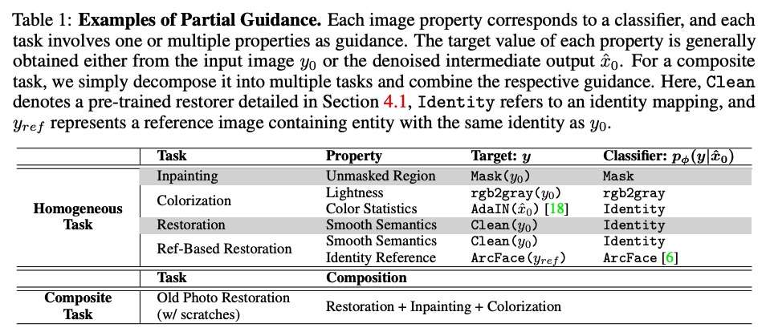
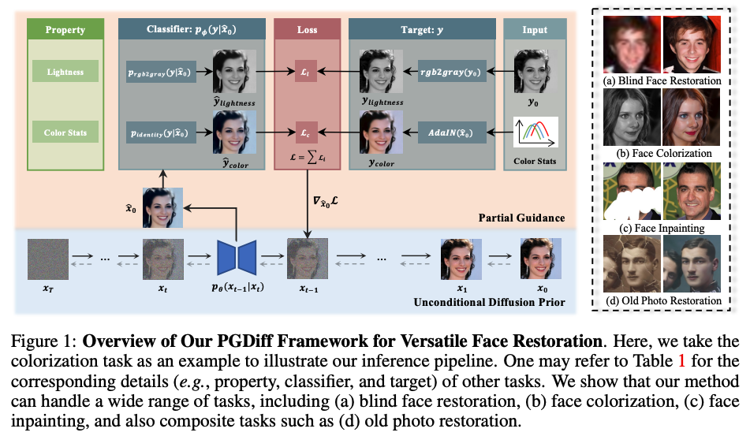
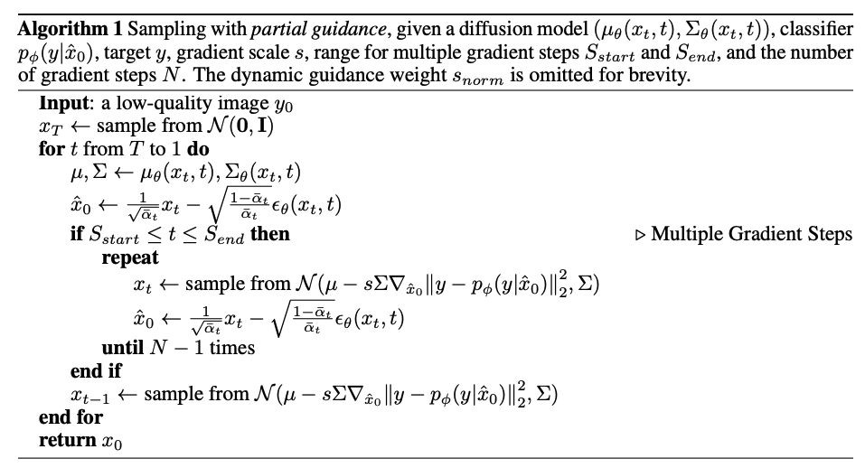

#  

- [PGDiff: Guiding Diffusion Models for Versatile Face Restoration via Partial Guidance](https://arxiv.org/pdf/2309.10810.pdf)
- 2023 Sep 19

# Abstract

Diffusion モデルを使用して画像の復元（restoration）を行うことが注目されてきている。partial guidance と呼んでいる手法を導入した PGDiff を本論文では提案しており、より実世界の劣化に対して適用可能なモデルとなっている。

# Introduction

## PGDiff

partial guidance による PGDiff は、classifier guidance を採用していて、denoising process をコントロールすることができる。

# Methodology

## Diffusion Models

### forward process
入力に逐次的にガウシアンノイズを加える過程。$1 \sim T$ の間隔でノイズを付与していく

$$
q(x_t|x_{t-1}) = \mathcal{N}(x_t; \sqrt{1-\beta_t}x_{t-1}, \beta \bm{I})
$$

### reverse process

ノイズ分布から画像に戻す過程、denoising process とも。時刻 $T$ では純粋なガウスノイズになっていて、そこから denoising していく。画像生成にはこの reverse process が使用される。この逆過程は近似されることがよくあり

$$
p_\theta(x_{t-1}|x_t) = \mathcal{N}(\mu_\theta(x_t,t), \Sigma_\theta(x_t, t))
$$

で表される。$\mu$ はネットワーク $\epsilon$ でパラメータ化されていて

$$
\mu_\theta(x_t, t) = \sqrt{\frac{1}{\alpha_t}} \left( x_t - \sqrt{\frac{\beta_t}{1 - \bar{\alpha}_t}} \epsilon_\theta(x_t, t) \right).
$$

で表される。

## Classifier guidance

unconditional diffusion model に制限を加えて、特定の条件のもとで生成を行うためのもの。

$y$ を生成したいときに $p_\phi(y|x)$ があったとして $g = \nabla_x \log p_\phi(y|x) | _{x=\mu_\theta(x_t,t)}$ の勾配を用いて条件付を行う(？)

## Partial Guidance

### Property & Classifier

まずどんな properties を作成するかを決める必要があり、それが Table.1 にまとまっている。それに従って intermediate output（中間生成物）が修正される。

Lightness を property に選んだ例が Figure.1 に示されている。特定の property に対して classifier を選択し、reverse process の際に classifier guidance を与えることで所望の出力を得ることができる。

#### 疑似アルゴリズム

- 入力：低品質の画像
- 初期値：ガウス分布から $x_T$ を生成する
- とある範囲 $S_{start} \leq t \leq S_{end}$ の場合、中間生成物 $x_t$ と（暫定）出力値 $\hat{x_0}$ を生成する
  - このときに、classifier の勾配を使用する
  - 新しい（修正された）$x_t$ を元に $\hat{x_0}$ を更新する
- $\nabla L$
  - Target $y$：入力から作成した情報（ex. $y=rgb2gray(y_0)$）
  - Classifier $y = p_\phi(y|\hat{x_0})$
  - 上記2つの差分をもって中間生成物を修正する

- dynamic guidance scheme を使用した

# Applications

- blind face restoration
  - あるノイズで劣化してしまった低品質画像を高品質化するというタスク。通常は MSE loss などで学習することが多いが、過剰に oversmooth なもの（lossを下げようとしてしまうもの）が生成される傾向にあるとのことで限界がある。
- Face colorization
  - 写真のカラー化
  - lightness と color の両面を表現した classifier を用意している
    - rgb2gray と AdaIN と呼ばれるもの
    - これらの情報と近くなるように調整することでカラー化できる？
- Face Inpainting
  - 隠れている部分を保管する
- Old photo restoration
  - 古い写真を修正する
- Reference-based face restoration
  - reference の写真を元に高画質化する

# Memo

## 気になったワード

- clasifier guidance

## 気になった論文
- Sketch-guided text-to-image diffusion models. 
-  Hila Chefer, Yuval Alaluf, Yael Vinker, Lior Wolf, and Daniel Cohen-Or. Attend-and-Excite:
Attention-based semantic guidance for text-to-image diffusion models. In SIGGRAPH, 2023.